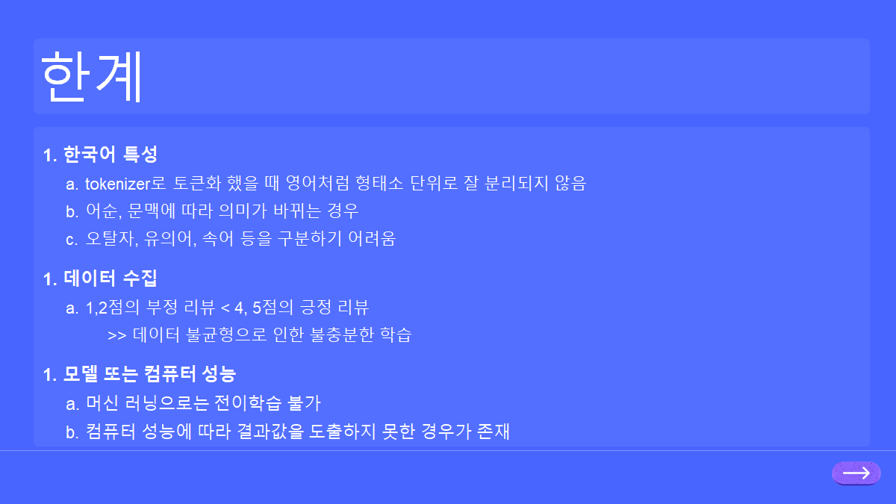

# 머신러닝 프로젝트

## 프로젝트 개요

- 프로젝트 명 : 쇼핑몰 5점 리뷰의 가치는 정말 '5점'인가에 대한 고찰

- 프로젝트 진행 배경
  
  - 상품 구매 여부에 많은 영향을 미치는 리뷰 중 5점에 상당 수의 홍보성 리뷰 혹은 단순히 적립금을 받기 위한 리뷰에 맞는 실제 점수를 예측하고자 프로젝트 진행

## 결론

- 최종 모델이 666개의 5점 리뷰 중 226개가 4점으로 재조정하고 나머지 440개의 5점은 변동이 없음

- 긍정(5,4점) 에 대한 예측이 부정(1,2점)에 비해 매우 정확하고 가장 예측을 못하는 것은 3점

- 모델이 부정보다 긍정에 대한 예측을 더 잘하는 원인으로는 데이터의 불균형을 예상

## 한계

- 오탈자, 유의어, 속어 등을 구분하기 어려움

- 5,4점에 비해 1,2점의 데이터가 현저히 적음

- 머신러닝으로는 전이학습 불가

## 프로젝트 발표 자료

